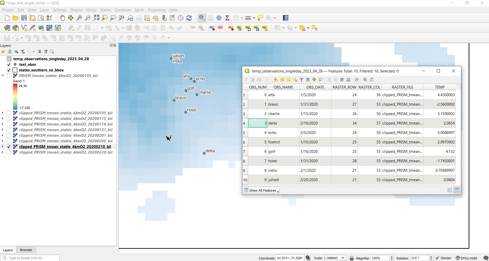

# Raster Temperature and Point Observation Overlay

Frank Donnelly
Head of GIS & Data Services

Brown University Library
April 19, 2023 / Revised March 7, 2024

-------------------------------------------

# Introduction

The purpose of this project is to overlay a set of observation points stored in a vector file (shapefile) on to a temperature raster, and pull the temperature from the grid cell for each intersecting point for a specific date. The observation date for each point is stored in a dedicated field, and the raster temperature data is organized with one file for each date, with the date embedded in the file name.

The raster temperature data is created by the PRISM Climate Group laboratory at Oregon State University at https://www.prism.oregonstate.edu/. You can download files that represent individual days in blocks per month or per year. Each file represents the continental United States for a given day stored in a .bil raster format at 4km resolution (2.485 miles). The date is hardcoded into each file name. The rasters are in the unprojected NAD 83 coordinate reference system, EPSG 4269, and temperatures are in degrees Celsius. Two months of temperature data were downloaded for January and February of 2020 for testing purposes. Please note that PRISM data is copyrighted and its terms (https://www.prism.oregonstate.edu/terms/) specify attribution and non-commercial use only.

The test observation data consists of ten points labelled *alfa* to *julliett* that represent a selection of cities within Rhode Island, taken from the Census Bureau's gazetteer of place names. In a recent revision, two additional points (*lima *and *kilo *) were added that fell outside of the study area. Each point was assigned a date that falls within the test study period. Some duplicate locations and dates were purposefully chosen. Coordinates are also in the NAD 83 system. The test data was created in a CSV format, then plotted in QGIS to create a shapefile.

It's assumed that: each raster file is identical in resolution and extent, all rasters use the same coordinate system, the coordinate system of the observation points matches the rasters, and all observation points have geometry (the observation data does not contain records that lack coordinates or geometry).

All of the work for this project was completed in Python, using several third party modules. The key geospatial modules include geopandas (for storing vector spatial data in a tabular dataframe format), rasterio (for working with rasters), shapely (for building vector geometry), and datetime (for converting varying date formats into a standard date data type).

# Folder Structure

The scripts rely on this folder structure, and look to these folders for loading input and exporting output. If this structure is modified or input files are not stored in the correct locations, the scripts will return errors and not run. 

**raster_temp_overlay**: primary folder, contains the two python scripts for batch clipping (*temp_clipper_batch.py*) and overlay (*temp_overlay_batch.py*), two test scripts (non-batch), QGIS test map files, and this README.

- **input_points**: contains the fictional test observation points shapefile, plus its sources (gazetteer file and CSV of points).
- **input_raster**:
  - **clipped**: the PRISM rasters clipped to the bounding box of southern New England, output from *temp_clipper_batch.py*.
  - **mask**: shapefile of the states of southern New England, its original TIGER source, and the bounding box created by *temp_clipper_batch.py*.
  - **to_clip**: original PRISM rasters of the entire continental US.
- output: CSVs generated from *temp_overlay_batch.py*, which contain temperature data for each observation, files date stamped based on the date the script was run.

# Step 1: Clipping

In order to speed processing time, each temperature raster was clipped to the extent of the study area. For this test, southern New England is the study area. The 2022 TIGER shapefile for US states was downloaded, and the states of Rhode Island, Connecticut, and Massachusetts were selected and exported out as a new shapefile.

The python script *temp_clipper_batch.py* was written to batch process and clip all the PRISM raster grids. The boundary file for the southern New England states is read into a geodataframe. The geopandas 'total_bounds' method is used to obtain coordinates that represent the minimum bounding rectangle or envelope for these states. Each coordinate pair for the rectangle is captured, and used to build a feature in a new geodataframe to store the box as a polygon with geometry. This bounding box is used as the mask layer to clip the rasters; this is to speed data processing, as it's much quicker to clip using a simple shape.

The script proceeds to loop through the directory where the PRISM temperature data is stored; each bil file is read into a rasterio raster format, and is clipped using the bounding box. Once the file is clipped, it's metadata is updated so the extent of the grid cells is recomputed, and the new layer is assigned the map projection of the original layer. The new clipped raster is saved as a GeoTiff file, using the same file name as the input layer but with the prefix 'clipped_'.

Once the process is finished, the last input and output raster are plotted and displayed on the screen, and the bounding box is output as a shapefile (for testing purposes).

# Step 2: Temperature Extraction

The python script *temp_overlay_iterate.py* was written to extract temperatures from the clipped rasters based on observation dates. At the top of the script, the user has the option to keep the '*temp_many_days*' variable as True, to extract the temperature from the current observation day and preceding N days, specified in the variable '*date_range*'. An average for all days will also be computed. Alternatively, if set to False the script will only extract the temperature for the current observation day.

The columns in the input observation shapefile that contain a unique id, name, and date must be specified at the top of the script.

First, the script iterates through the directory that contains the clipped raster files. If the file ends with .tif, the program takes the file name, splits it into a list based on the location of the underscores, and pulls the item that contains the date. The date is converted into a standard date format, and this date and the path to the raster file are stored in a dictionary called '*rf_dict*', where each date is a key and the corresponding value is the path to the raster file for that date.

Next, the shapefile of point observations is read into a geodataframe. An empty '*result_list*' is created to hold new data, and a header row is added as the first record. The observation number, name, and date are carried over from the shapefile. The raster row and column will indicate the grid cell that overlaps with the point, and the raster file for the observation date is recorded, as well as the temperature. If the user opted to get multiple preceding days, additional columns are added based on the number of days, along with an average of all days.

At this point, set up is complete. The main loop in the program iterates over the index of each observation in the dataframe. The observation date is pulled, converted to a standard date format, and passed to the dictionary *'rf_dict*', where the corresponding raster for that date is pulled. If there is no raster for that date, a message is printed to the screen and the loop proceeds to the next point. Else, the raster for that date is opened in rasterio. The X and Y coordinates for the observation are pulled from its geometry, and the matching grid cell based on row and column in the raster are pulled. The temperature value for that cell is recorded, and the file name for the raster is split from its path location. All of this information is stored in a record list; if '*temp_many_days*' was set to False, the loop skips to the end and appends that record to '*result_list*', and proceeds to the next observation.

However, if '*temp_many_days*' was set to True, we enter a new loop that iterates over the number of days specified in '*date_range*' for the current observation. Using the timedelta function, we iteratively subtract the number of days in the range to get the earlier dates, pull the raster path for those dates from the dictionary, and obtain their temperature values. It's assumed that each raster file is identical in resolution and extent, and that they all use the same coordinate system. If there is no file for a given date, None is recorded. Once all the dates for the observation have been obtained, None values are deleted and the current observation is added to a list. The max and min temperatures are pulled and subtracted to calculate a range, and the values of the list are summed and divided by their count to get an average. Finally, the record with all raster data plus the extra temps are appended to '*result_list*', and the script moves on to the next observation.

In a recent revision, logic was added to handle point observations that fall outside of the clipped raster, to avoid triggering errors or recording false data. If the cell reference for a point is less than zero or is greater than the width or height of the raster, cell references are recorded but None is written as the temperature value. If '*temp_many_days*' is True, None is recorded for all values for out of bounds observations.

When complete, the final raster that was pulled for the last observation is plotted to the screen, along with all of the overlay points. The '*result_list*' that contains all of the data is written out to a CSV file, named with the generic 'temp_observations" plus a date stamp for today's date (if the program is run multiple times on the same day, this file gets overwritten).

# Results / QC

Three tests were conducted in QGIS to insure that the results generated from the script were accurate.

1. One of the clipped rasters was compared to the original US raster from which it was clipped, to verify that the pixel resolution is the same, and that the cells that were clipped correspond to the generated bounding box. The layers (US raster, southern New England raster, bounding box shapefile, and observation shapefile) rendered and overlayed properly, in the NAD 83 CRS.

2. The script was run with '*temp_many_days*' set to False, to pull observations for a single day only. The observation shapefile and rasters that corresponded to the dates of the observations were added an overlayed. The temperatures returned by the script were manually checked, by clicking on each raster cell for the appropriate date where an observation was located, checking it's temperature value, and comparing it to the temperature returned by the script. All ten in bounds sample points were verified and matched. 

3. The script was run with '*temp_many_days*' set to True, to pull observations for a seven day time period (observation day plus six preceding days). The relevant rasters were displayed for two specific observation points, each of the seven temperatures in the script output were checked manually against the appropriate raster for each date, and the average was calculated by hand and compared to the output. Two sample points were checked: point '*hotel*' was chosen to represent a normal case with 7 days of temperature data, while point '*alfa*' was chosen because it was missing rasters for given dates (observation date was 1/5/2020, and sample rasters do not precede 1/1/2020). All data points for these two observations were verified and matched. In addition, points '*foxtrot*' and '*golf*' were created using identical coordinates and thus are in the same grid location, but their observations dates are one day apart. The range of observations for these points matched correctly as being one day out of step, where TEMP for *foxtrot* (obs date 1/15) is equal to TMINUS_1 for *golf*  (obs date 1/16, so one day before is 1/15).

